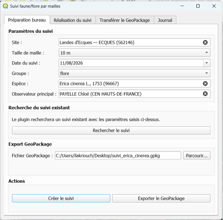

# Suivi par mailles

Plugin QGIS pour préparer, réaliser et transférer un **suivi de biodiversité (faune ou flore)** selon un protocole de **présence / absence** par maille.

> Développé lors d'un stage de fin d'études au CEN Hauts-de-France.

## Protocole

1. **Préparation (bureau)** : choisir le site, le groupe (**faune** ou **flore**), l'espèce et la taille de maille (5 à 100 m), puis exporter un GeoPackage contenant les mailles.
2. **Terrain (tablette)** : cliquer sur chaque maille pour la renseigner, avec la position GNSS/RTK affichée dans QGIS.
   - 1er clic : **présence** (vert)
   - 2e clic : **absence** (rouge)
   - 3e clic : **non renseignée**
3. **Transfert (bureau)** : contrôler le GeoPackage puis intégrer les observations dans la base PostgreSQL/PostGIS.

Un onglet **Journal** garde l'historique des opérations.

## Prérequis

- QGIS 3.x ou 4.x
- Une base PostgreSQL/PostGIS (script de création des tables dans `sql.sql`)
- Un récepteur GPS/GNSS pour le terrain

## Installation

1. Télécharge le ZIP de la dernière version dans **Releases**.
2. Dans QGIS : **Extensions > Installer/Gérer les extensions > Installer depuis un ZIP**.
3. Le plugin apparaît dans **Extensions > Suivi par mailles**.

## Technologies

Python, PyQGIS, PostgreSQL/PostGIS, GeoPackage, GNSS/RTK.

## Auteure

Ikram Lakriouch — géomaticienne.

## Licence

GNU GPL v3. Voir [LICENSE](LICENSE).
